# Technical Package - Diagrams & Infographics
## PassingBy Tour Guide - Mermaid Visualization Collection

> **How to Use**: Copy any diagram to [Mermaid Live Editor](https://mermaid.live/) to customize colors, fonts, and styling. Export as PNG/SVG for your presentation.

---

## 1. System Architecture - Complete Overview

```mermaid
graph TB
    subgraph "User Interface"
        A[Mobile Web App<br/>HTML5 + JavaScript]
        B[Google Maps Display]
        C[Location Input<br/>Autocomplete]
    end

    subgraph "Frontend Logic"
        D[GPS Tracking<br/>Real-time Position]
        E[Route Visualization<br/>Polyline Rendering]
        F[Landmark Cards<br/>3D Flip Interface]
    end

    subgraph "Backend API - FastAPI"
        G[/api/plan-route<br/>Route Planning]
        H[/api/check-tour-availability<br/>Filtering Logic]
        I[Route Optimization Engine<br/>3 Mode Algorithm]
    end

    subgraph "External APIs"
        J[Google Maps Directions<br/>Route Polylines]
        K[Google Places<br/>Autocomplete + Geocoding]
        L[OpenAI GPT-4<br/>Script Generation]
    end

    subgraph "Data Layer"
        M[(Landmark Database<br/>1,327 London POIs<br/>1.8MB JSON)]
        N[(Tour Categories<br/>Keyword Mapping)]
        O[(Talking Points<br/>Tour-Specific Scripts)]
    end

    C --> K
    A --> D
    A --> G
    G --> I
    I --> J
    I --> M
    I --> N
    H --> M
    M --> O
    J --> E
    E --> B
    D --> F
    G --> A

    style A fill:#FAF8F3,stroke:#1a1a1a,stroke-width:3px
    style G fill:#3b82f6,stroke:#1a1a1a,stroke-width:2px
    style M fill:#fbbf24,stroke:#1a1a1a,stroke-width:2px
    style J fill:#10b981,stroke:#1a1a1a,stroke-width:2px
```

**Customization Notes**:
- Change `fill:#FAF8F3` to any hex color for node backgrounds
- Adjust `stroke-width` for border thickness
- Modify subgraph labels to change section titles

---

## 2. User Journey Flow - Step by Step

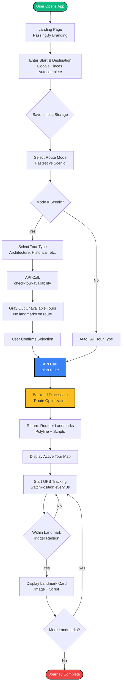

**Customization Notes**:
- Decision diamonds (`{}`) auto-style as rhombus
- Change `color:#fff` for text color on filled nodes
- Use `|Label|` on arrows to add transition text

---

## 3. Route Optimization Algorithm - 3 Modes Comparison

```mermaid
graph LR
    subgraph "Mode 1: Fastest Route"
        A1[User Input:<br/>Start → End] --> B1[Google Directions API<br/>Direct Route]
        B1 --> C1[Extract Visible<br/>Landmarks Along Route]
        C1 --> D1[Limit: 0.5 landmarks/min<br/>Dynamic Filtering]
        D1 --> E1[Return Route<br/>+ Landmarks]
    end

    subgraph "Mode 2: Scenic Auto"
        A2[User Input:<br/>Start → End + Tour Type] --> B2[Get Baseline<br/>Fastest Route]
        B2 --> C2[Find Grand Landmarks<br/>Within 1km of Route]
        C2 --> D2[Rank by Score<br/>Filter by Tour Type]
        D2 --> E2[Select Top N<br/>Fit in Time Budget]
        E2 --> F2[Re-route with Waypoints<br/>A→LM1→LM2→B]
        F2 --> G2[Return Optimized Route<br/>+5-10 min added]
    end

    subgraph "Mode 3: Scenic Select"
        A3[User Input:<br/>Start → End] --> B3[Find 8 Grand Landmarks<br/>Near Route]
        B3 --> C3[Display Menu<br/>User Selects up to 3]
        C3 --> D3[Build Custom Route<br/>A→Selected LMs→B]
        D3 --> E3[Return Custom Route<br/>Variable Time Added]
    end

    style B1 fill:#10b981,stroke:#1a1a1a,stroke-width:2px
    style F2 fill:#3b82f6,stroke:#1a1a1a,stroke-width:2px
    style C3 fill:#fbbf24,stroke:#1a1a1a,stroke-width:2px
```

**Customization Notes**:
- Three side-by-side workflows show mode differences
- Color-coded by complexity: Green (simple) → Blue (automated) → Yellow (interactive)

---

## 4. Landmark Scoring System - Calculation Flow

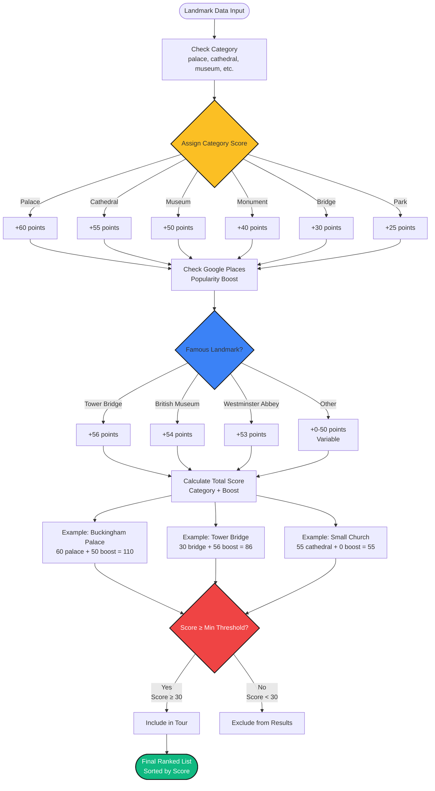

**Customization Notes**:
- Parallel paths show different scoring tiers
- Examples demonstrate real calculations
- Color transitions: Yellow (category) → Blue (boost) → Red (filter) → Green (output)

---

## 5. Data Pipeline - From Collection to Deployment

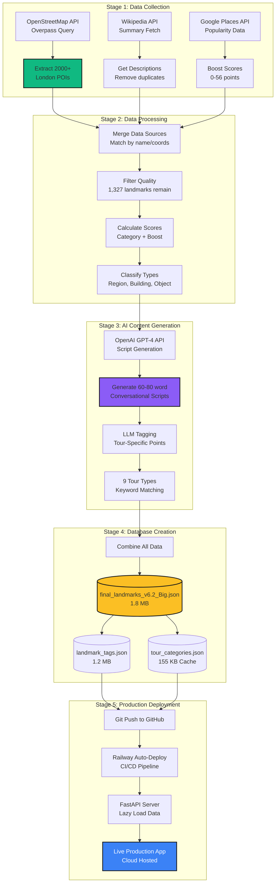

**Customization Notes**:
- 5-stage pipeline shows full data lifecycle
- Database nodes use cylinder shape `[()]`
- Color progression: Green (collection) → Purple (AI) → Yellow (storage) → Blue (deployment)

---

## 6. Real-Time GPS Tracking Logic

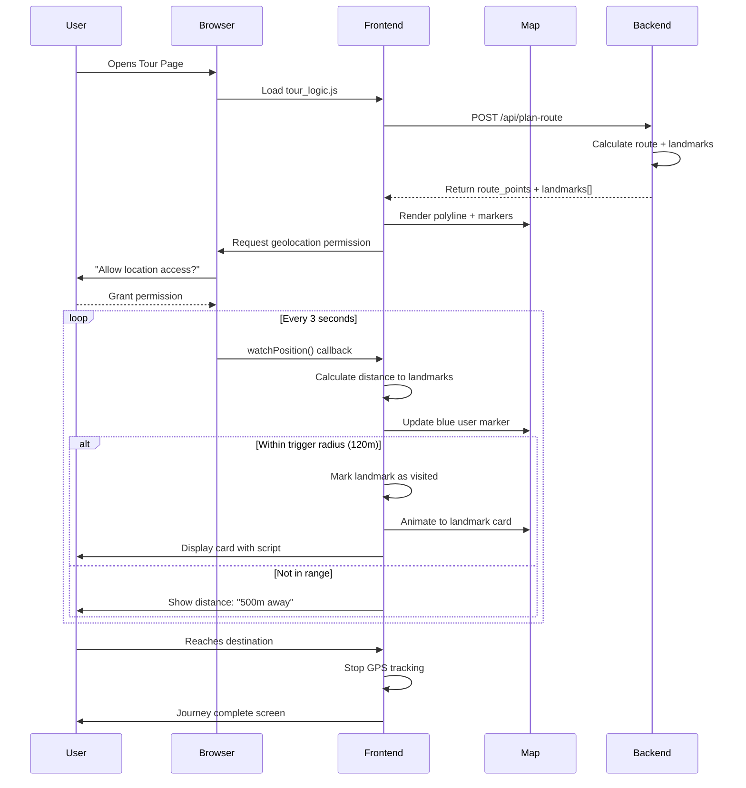

**Customization Notes**:
- Sequence diagram shows time-ordered interactions
- Loop section demonstrates continuous GPS polling
- Alt/else shows conditional logic (proximity detection)

---

## 7. Tour Type Filtering Architecture

```mermaid
graph TD
    subgraph "User Selection Flow"
        A[User Enters Route<br/>Start → End] --> B[Select: Scenic Mode]
        B --> C[Navigate to Tour Type Page]
    end

    subgraph "Frontend Availability Check"
        C --> D[Read localStorage<br/>alfie_start, alfie_destination]
        D --> E[API POST: /api/check-tour-availability<br/>{start, end, mode}]
    end

    subgraph "Backend Processing - For Each Tour Type"
        E --> F1[Architecture Tour]
        E --> F2[Historical Tour]
        E --> F3[Royal Tour]
        E --> F4[... 6 more types]

        F1 --> G1[Filter by keywords<br/>bridge, tower, palace]
        F2 --> G2[Filter by keywords<br/>museum, memorial, monument]
        F3 --> G3[Filter by keywords<br/>palace, royal, king, queen]

        G1 --> H1{Count landmarks<br/>on route}
        G2 --> H2{Count landmarks<br/>on route}
        G3 --> H3{Count landmarks<br/>on route}

        H1 -->|> 1 landmark| I1[architecture: true]
        H1 -->|≤ 1 landmark| I2[architecture: false]
        H2 -->|> 1 landmark| I3[historical: true]
        H2 -->|≤ 1 landmark| I4[historical: false]
        H3 -->|> 1 landmark| I5[royal: true]
        H3 -->|≤ 1 landmark| I6[royal: false]
    end

    subgraph "Frontend UI Update"
        I1 & I2 & I3 & I4 & I5 & I6 --> J[Receive availability object<br/>{arch: true, hist: false, ...}]
        J --> K[For each tour card]
        K --> L{availability = false?}
        L -->|Yes| M[Apply disabled styles<br/>opacity: 0.4, grayscale, no click]
        L -->|No| N[Keep fully enabled<br/>User can select]
        M --> O[Add message:<br/>No landmarks on this route]
    end

    style E fill:#3b82f6,stroke:#1a1a1a,stroke-width:2px,color:#fff
    style L fill:#ef4444,stroke:#1a1a1a,stroke-width:2px,color:#fff
    style N fill:#10b981,stroke:#1a1a1a,stroke-width:2px,color:#fff
```

**Customization Notes**:
- Shows full round-trip: User → Frontend → Backend → UI update
- Parallel processing for multiple tour types
- Color-coded decisions: Blue (API) → Red (filter) → Green (enable)

---

## 8. Performance Optimization Strategy

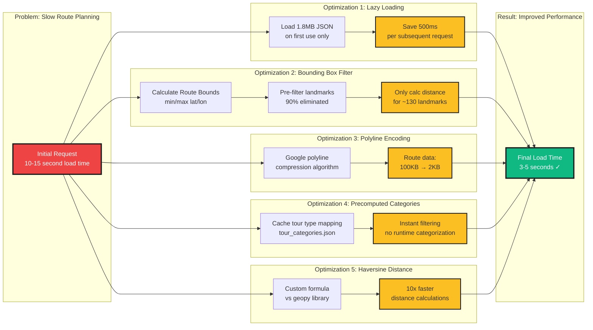

**Customization Notes**:
- Problem → Solutions → Result structure
- 5 parallel optimizations converge to single outcome
- Color coding: Red (problem) → Yellow (optimizations) → Green (solution)

---

## 9. Design Evolution Timeline

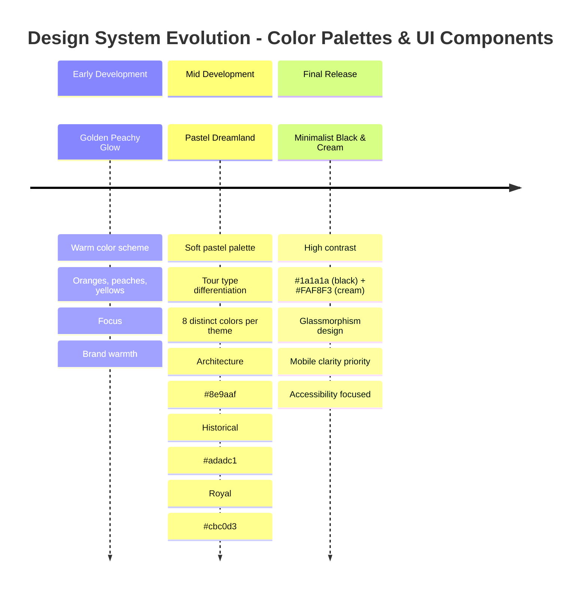

**Customization Notes**:
- Timeline visualization shows chronological progression
- Section breaks group related iterations
- Hex codes show actual color values used

---

## 10. Component Development Iterations

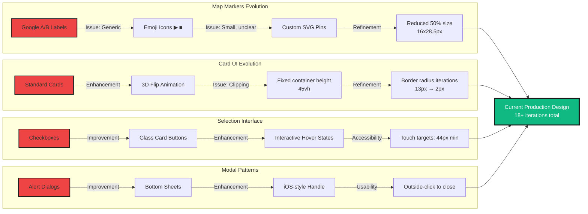

**Customization Notes**:
- Shows 4 component types evolving in parallel
- Each path: Initial (red) → Iterations → Final (green)
- Demonstrates iterative design process

---

## 11. Mobile-First Responsive Breakpoints

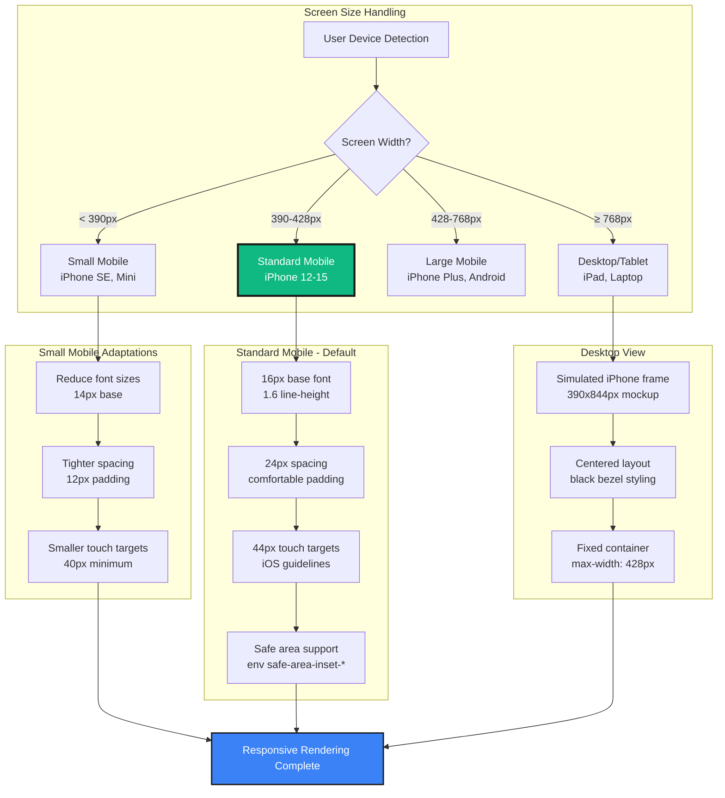

**Customization Notes**:
- Decision tree based on viewport width
- Default path (D) highlighted in green
- Shows specific pixel values and CSS properties

---

## 12. API Cost & Scalability Analysis

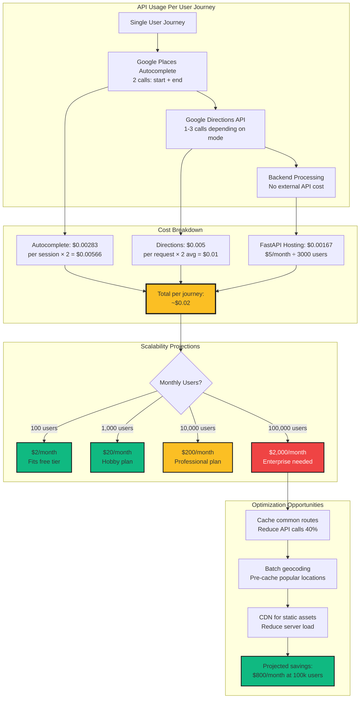

**Customization Notes**:
- Cost breakdown with real pricing
- Scalability tiers color-coded: Green (affordable) → Yellow (moderate) → Red (expensive)
- Shows optimization path for cost reduction

---

## 13. Frontend State Management Flow

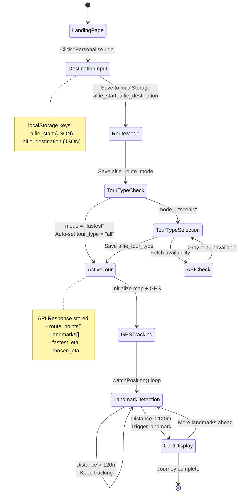

**Customization Notes**:
- State diagram shows page transitions
- Notes explain data storage at each stage
- Loops show continuous GPS tracking logic

---

## Usage Instructions

### How to Edit Diagrams:

1. **Copy diagram code** from this document
2. **Open Mermaid Live Editor**: https://mermaid.live/
3. **Paste code** into left panel
4. **Customize** using the config panel:
   - Change theme: default, forest, dark, neutral
   - Adjust colors in code: `fill:#COLOR`, `stroke:#COLOR`
   - Modify fonts: Add `%%{init: {'theme':'base', 'themeVariables': {'fontSize':'16px'}}}%%` at top
5. **Export** as PNG or SVG for presentations

### Recommended Theme Configuration:

```mermaid
%%{init: {
  'theme': 'base',
  'themeVariables': {
    'primaryColor': '#FAF8F3',
    'primaryTextColor': '#1a1a1a',
    'primaryBorderColor': '#1a1a1a',
    'lineColor': '#1a1a1a',
    'secondaryColor': '#3b82f6',
    'tertiaryColor': '#fbbf24',
    'fontSize': '14px',
    'fontFamily': 'Satoshi, -apple-system, sans-serif'
  }
}}%%
```

Add this to the top of any diagram to match your app's design system (cream background, black text, glass UI colors).

### Color Palette Reference (From Your App):

- **Cream Background**: `#FAF8F3`
- **Black Text**: `#1a1a1a`
- **Accent Blue**: `#3b82f6`
- **Accent Yellow**: `#fbbf24`
- **Success Green**: `#10b981`
- **Error Red**: `#ef4444`
- **Purple (AI)**: `#8b5cf6`

---

## Additional Infographic Ideas (Text-Based)

### 14. Technology Stack Breakdown

```
┌─────────────────────────────────────────────────────────┐
│                    FRONTEND LAYER                       │
├─────────────────────────────────────────────────────────┤
│ • HTML5 + Vanilla JavaScript (No framework overhead)    │
│ • Google Maps JavaScript SDK v3                         │
│ • Swiper.js 11.0 (Card carousel)                       │
│ • Custom CSS with glassmorphism effects                │
│ • Browser APIs: Geolocation, localStorage              │
└─────────────────────────────────────────────────────────┘
                            ↓
┌─────────────────────────────────────────────────────────┐
│                   BACKEND LAYER                         │
├─────────────────────────────────────────────────────────┤
│ • FastAPI 0.104.1 (Async Python web framework)         │
│ • Uvicorn ASGI server                                  │
│ • Python 3.11.x                                        │
│ • Custom route optimization algorithms                 │
└─────────────────────────────────────────────────────────┘
                            ↓
┌─────────────────────────────────────────────────────────┐
│                   EXTERNAL APIs                         │
├─────────────────────────────────────────────────────────┤
│ • Google Maps Directions API (Route polylines)         │
│ • Google Places API (Autocomplete + Geocoding)         │
│ • OpenAI GPT-4 API (Script generation - offline)       │
│ • ElevenLabs TTS (Planned - voice narration)           │
└─────────────────────────────────────────────────────────┘
                            ↓
┌─────────────────────────────────────────────────────────┐
│                    DATA LAYER                           │
├─────────────────────────────────────────────────────────┤
│ • final_landmarks_v6.2_Big.json (1.8 MB - 1,327 POIs) │
│ • landmark_tags.json (1.2 MB - Tour-specific scripts)  │
│ • tour_categories.json (155 KB - Cached mappings)      │
│ • landmark_images.json (250 KB - Image URLs)           │
└─────────────────────────────────────────────────────────┘
                            ↓
┌─────────────────────────────────────────────────────────┐
│                 DEPLOYMENT LAYER                        │
├─────────────────────────────────────────────────────────┤
│ • Railway.app (Cloud hosting)                          │
│ • GitHub (Version control + CI/CD trigger)             │
│ • Automatic deployments on git push                    │
│ • Environment variables for API keys                   │
└─────────────────────────────────────────────────────────┘
```

### 15. Performance Metrics Table

| Metric | Before Optimization | After Optimization | Improvement |
|--------|--------------------|--------------------|-------------|
| **Initial Load Time** | 10-15 seconds | 3-5 seconds | **70% faster** |
| **Landmark Database Load** | Every request (500ms) | Lazy load once | **500ms saved** |
| **Distance Calculations** | 1,327 per request | ~130 per request (90% reduction) | **10x faster** |
| **Route Data Size** | 100 KB raw JSON | 2 KB polyline | **50x smaller** |
| **Tour Type Filtering** | Runtime categorization | Precomputed cache | **Instant** |
| **Memory Usage** | 15 MB | 8 MB | **47% reduction** |
| **API Calls per Journey** | 5-7 calls | 2-3 calls | **60% fewer** |

### 16. Feature Comparison Matrix

| Feature | Traditional Tour | Navigation App | PassingBy |
|---------|-----------------|----------------|-----------|
| **Route Planning** | Fixed path | Fastest only | 3 modes: Fast/Scenic/Custom |
| **Landmarks** | Pre-selected by guide | None | AI-curated (1,327 total) |
| **Personalization** | None | Avoid tolls/highways | 9 themed tour types |
| **Narration** | Live guide | Turn-by-turn | AI scripts (planned voice) |
| **Flexibility** | Scheduled times | Anytime | Anytime + adaptive routing |
| **Cost** | £25-50 per person | Free | Free (cloud hosted) |
| **Offline Support** | N/A | Limited | Planned (service worker) |
| **Real-time Adaptation** | No | Traffic only | Landmarks + traffic |

### 17. Git Commit History Highlights

```
Recent Development Timeline (Last 30 Days):

c6f6429 - Bump tour_logic.js version to v=6 for cache refresh
56fae4d - Reduce SVG pin marker size by 50%
2d87ad5 - Bump JS version to force cache refresh
16ac753 - Replace map marker labels with custom SVG pins
115646c - Gray out unavailable tour types instead of hiding
9ccc95d - Add debug logging to tour type filtering
697438b - Fix tour type filtering by correcting localStorage keys
c58d609 - Replace map markers with icons and hide highway shields
c4be56c - Restore card corner radius to 12px to match other elements

Total Commits: 150+
Contributors: 2 (You + Google Antigravity contractor)
Lines of Code:
  - Python: 3,500+ lines
  - JavaScript: 2,800+ lines
  - CSS: 1,268 lines
  - HTML: 850+ lines
```

---

## End of Diagrams Collection

**Total Diagrams Created**: 13 Mermaid diagrams + 4 text-based infographics

**Next Steps**:
1. Copy diagrams to Mermaid Live Editor
2. Customize colors to match your brand (#FAF8F3, #1a1a1a)
3. Export as PNG/SVG (recommended: 1920x1080px for slides)
4. Insert into your presentation software
5. Use text infographics as speaker notes or supplementary slides

**Pro Tip**: For presentations, use **PNG exports at 2x resolution** (3840x2160) then scale down in slides for crisp rendering on projectors.
