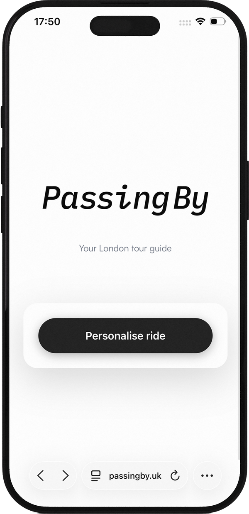
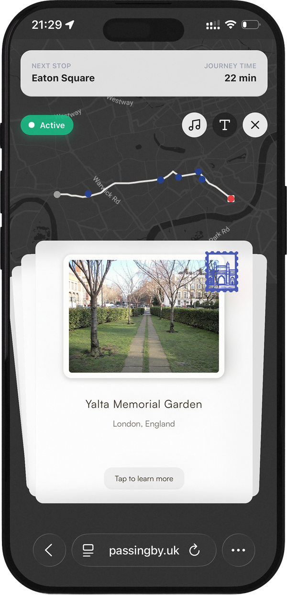
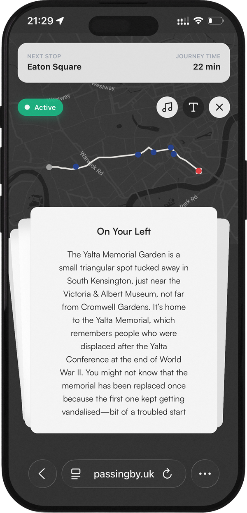
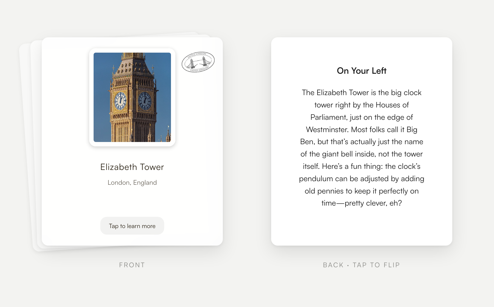
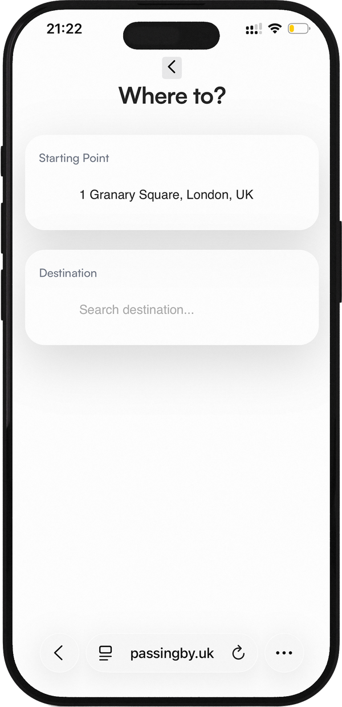
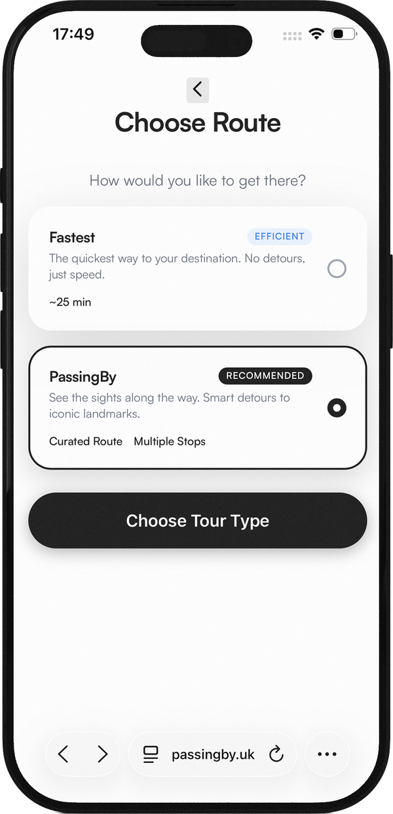
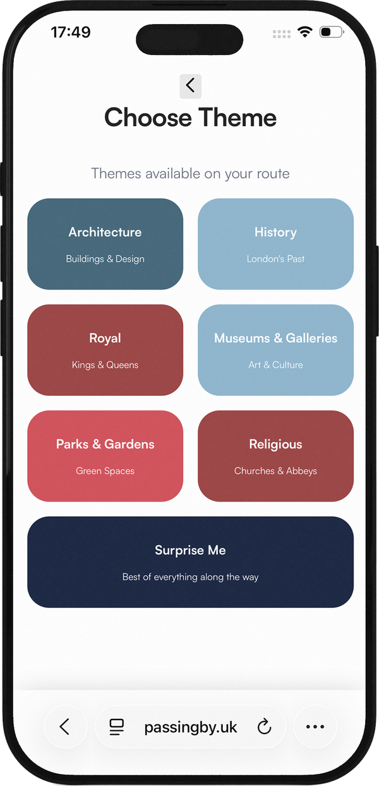
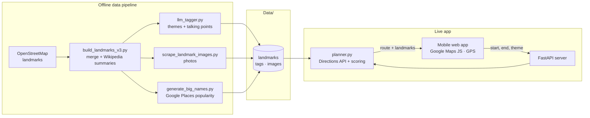

<div align="center">

<picture>
  <source media="(prefers-color-scheme: dark)" srcset="docs/images/logo-dark.png">
  
</picture>

<br>
<br>

**Turn any cab ride across London into a city tour.**
<br>
PassingBy plans a scenic route between any two points in London and tells you the story of each landmark as you pass it, whether you're riding or walking.

<br>

[](https://www.passingby.uk/mobile)


[](#license)

[**Try it live**](https://www.passingby.uk/mobile) · [Watch the demo](https://www.youtube.com/watch?v=hFkSI2gQjCA) · [How it works](#how-it-works) · [Run it locally](#run-it-locally)

<br>


&nbsp;&nbsp;

&nbsp;&nbsp;


</div>

> [!IMPORTANT]
> **Free for non-commercial use. Commercial use requires a licence.**
> You're welcome to use, study and adapt PassingBy for personal, educational and non-profit projects.
> If you'd like to use it commercially, build a product on it, or work together on a similar idea, [get in touch](https://kubajarzebski.xyz/). See [License](#license).

<br>

## See it in action

<div align="center">
  <a href="https://www.youtube.com/watch?v=hFkSI2gQjCA">
    
  </a>
  <br>
  <sub>A walkthrough of a ride, from planning the route to the landmark cards. Opens on YouTube.</sub>
</div>

## The idea

Every day, people ride through London in black cabs, past centuries of history, and see very little of it. PassingBy turns that journey into a tour. You enter the trip you were already going to make, and it plans a route that bends a little to take in the city's best sights. As the cab moves, your phone's GPS triggers a card for each landmark you pass, with a short story told by Alfie, a friendly London cabbie.

The same route and stories work on foot, so you can also use it as a self-guided walking tour.

<div align="center">
  
  <br>
  <sub>Each landmark arrives as a postcard. Tap it to flip from the photo to the story.</sub>
</div>

## A ride, step by step

<table>
  <tr>
    <td align="center" width="25%"></td>
    <td align="center" width="25%"></td>
    <td align="center" width="25%"></td>
    <td align="center" width="25%"></td>
  </tr>
  <tr>
    <td align="center"><b>1. Where to?</b><br><sub>Your location fills in the start point. Search for a destination.</sub></td>
    <td align="center"><b>2. Choose a route</b><br><sub><i>Fastest</i>, or <i>PassingBy</i> with detours past the sights.</sub></td>
    <td align="center"><b>3. Pick a theme</b><br><sub>Only themes with landmarks on your route are shown.</sub></td>
    <td align="center"><b>4. Ride</b><br><sub>Cards appear as you pass each landmark. Tap to read the story.</sub></td>
  </tr>
</table>

## Features

- **Two ways to ride.** *Fastest* takes the direct route. *PassingBy* adds short detours through the most iconic landmarks near your path, capped so the trip only takes a few minutes longer.
- **Nine themed tours.** Architecture, Historical, Royal, Museums & Galleries, Parks & Gardens, Religious Heritage, Modern London, Victorian Era, or everything.
- **Location-triggered stories.** Each landmark has its own trigger radius (larger for a palace, smaller for a statue), so its card appears just as it comes into view.
- **1,327 curated landmarks.** Built from OpenStreetMap and Wikipedia, each with a photo and AI-written talking points for every tour theme.
- **Ranked by popularity.** Google Places ratings boost the landmarks people actually care about, so a PassingBy route passes Tower Bridge before an obscure plaque.
- **Ride or walk.** Built for the back seat of a cab, and it works just as well on foot.
- **Nothing to install.** It's a mobile web app: open the link, allow location access, and go.

## Try it

<table>
  <tr>
    <td></td>
    <td>
      Scan with your phone, or open <a href="https://www.passingby.uk/mobile"><b>passingby.uk</b></a>.<br><br>
      Set a start and end point in central London, pick a tour theme, and go.<br>
      <sub>Works best with location access allowed.</sub>
    </td>
  </tr>
</table>

## How it works

The heavy work happens **offline**. A set of build scripts turns raw map data into a curated landmark database with images and pre-written stories. The **live** server only has to plan a route and pick which landmarks to show, so it stays fast and cheap to run: the live site makes no LLM calls.



1. **Plan.** The server asks the Google Directions API for a driving route. In *PassingBy* mode it scores nearby landmarks by theme, popularity and detour cost, then re-routes through the best ones as waypoints.
2. **Match.** It finds every landmark within reach of the final route and attaches the story written for the chosen theme.
3. **Ride.** The browser follows your position with the Geolocation API. When you come within a landmark's trigger radius, its card slides in.

## Tech stack

| Layer | Tools |
|---|---|
| Backend | Python, FastAPI, Uvicorn, Jinja2 |
| Frontend | Vanilla JavaScript, HTML/CSS, Swiper, Satoshi typeface |
| Maps | Google Maps JavaScript API, Places API, Directions API |
| Data pipeline | OpenStreetMap, Wikipedia API, Wikimedia Commons, OpenAI API |
| Hosting | Railway, custom domain |

## Project structure

```
├── server.py                  FastAPI app: pages + JSON API
├── App/
│   ├── planner.py             Route planning (fastest / scenic)
│   ├── landmarks.py           Landmark scoring and selection
│   ├── route_landmark_finder.py  Geometry: landmarks near a route
│   ├── tour_types.py          The nine tour themes
│   ├── talking_points.py      Loads the pre-written stories
│   ├── config.py              Tunable limits, weights and colours
│   ├── build_landmarks_v3.py  ┐
│   ├── llm_tagger.py          │ Offline data pipeline
│   ├── scrape_landmark_images.py │
│   ├── generate_big_names.py  ┘
│   └── Web_App/               Mobile templates, JS, CSS, fonts, images
├── Data/                      Landmark database, tags, images, categories
├── scripts/                   QR code and exhibition receipt generators
├── tests/                     Routing experiments
└── docs/images/               Logo, designs, QR codes
```

## Run it locally

**Requirements:** Python 3.9 or newer, and a Google Cloud project with the Maps JavaScript, Places and Directions APIs enabled.

```bash
git clone https://github.com/qubula/PassingBy-London.git
cd PassingBy-London

python3 -m venv venv
source venv/bin/activate
pip install -r requirements.txt

cp .env.example .env        # then add your own keys
uvicorn server:app --reload
```

Open <http://localhost:8000/mobile>.

To test GPS on a real phone, the page must be served over HTTPS. Create a self-signed certificate once, then run `start_https.sh` to serve the app on your local network:

```bash
openssl req -x509 -newkey rsa:4096 -nodes -days 365 \
  -keyout key.pem -out cert.pem -subj "/CN=localhost"
./start_https.sh
```

### Environment variables

| Variable | Used by | Notes |
|---|---|---|
| `GOOGLE_MAPS_BROWSER_KEY` | Browser | Restrict it to your domain. Maps JavaScript + Places APIs only. |
| `GOOGLE_DIRECTIONS_KEY` | Server | Directions API only. Never sent to the browser. |
| `OPENAI_API_KEY`, `PEXELS_API_KEY`, `UNSPLASH_ACCESS_KEY` | Offline scripts | Only needed to rebuild the data in `Data/`. |

### Deploying

The repo includes a `Procfile` and `railway.json`, so it deploys to [Railway](https://railway.app) as-is. Connect the repository and add the two Google keys as variables.

## License

PassingBy is **source-available** under the [PolyForm Noncommercial License 1.0.0](LICENSE).

| Use | Cost |
|---|---|
| Personal projects, learning, teaching, research, portfolios, non-profit organisations | ✅ **Free** |
| Anything that makes money: paid apps, client work, ad-supported products, use inside a business | 💼 **Commercial licence required** ([contact me](https://kubajarzebski.xyz/)) |

**Commercial licensing and collaboration.** If you want to monetise PassingBy, build something similar, or bring me in to help, I'd be glad to talk. Contact me through my [portfolio](https://kubajarzebski.xyz/) or on [LinkedIn](https://www.linkedin.com/in/jakub-jarzebski).

Third-party data and assets (OpenStreetMap, Wikipedia, Wikimedia Commons photos, Satoshi) keep their own licences; see [LICENSE](LICENSE) for details.

## Credits

- Landmark data © [OpenStreetMap](https://www.openstreetmap.org/copyright) contributors (ODbL)
- Landmark summaries from [Wikipedia](https://www.wikipedia.org/) (CC BY-SA)
- Landmark photos from [Wikimedia Commons](https://commons.wikimedia.org/) (free licences; see each file's page for its author and terms)
- Typeface: [Satoshi](https://www.fontshare.com/fonts/satoshi) by Indian Type Foundry

<br>

<div align="center">
Designed and built by <b>Jakub Jarzebski</b>
<br>
<a href="https://kubajarzebski.xyz/">Portfolio</a> · <a href="https://www.linkedin.com/in/jakub-jarzebski">LinkedIn</a> · <a href="https://github.com/qubula">GitHub</a>
</div>
